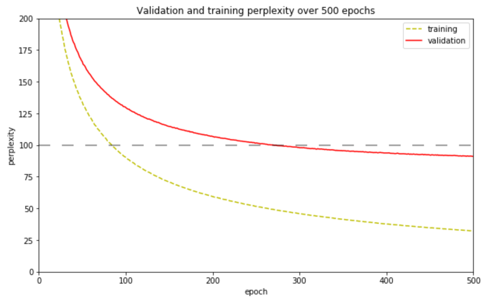

# AWD-LSTM

A PyTorch implementation of the paper ["Regularizing and Optimizing LSTM Language Models"](https://arxiv.org/abs/1708.02182). 

Language modelling, at a word level, involves calculating the conditional probability of a word occurring given some other sequence of words. In this case we predict a word given the sequence of words that precede it. 

This paper achieved state-of-the-art word level perplexities on two data sets in 2017: 57.3 on Penn Treebank and 65.8 on WikiText-2. It was cited by subsequent papers that showed the potential for using language modelling as a means to pre-train models before applying them to other NLP tasks ([ULMFiT](https://arxiv.org/pdf/1801.06146.pdf), [ELMo](https://arxiv.org/pdf/1802.05365.pdf)). 

The Penn Treebank implementation of this model has 24M parameters and is trained on a 6MB dataset. The WikiText-2 implementation has 33M parameters and is trained on 13MB of English language text. 


## To run

With [anaconda](https://docs.anaconda.com/anaconda/install/) package manager installed:

1. Create conda environment to install dependencies:
    ```
    conda env create -f environment.yml
    ```
2. Activate the new environment 
    ```
    conda activate awdlstm
    ```

3. Train the model:
    ```
    python main.py
    ```

Notes: Nvidia GPUs supported. 500 epochs of training takes roughly 48 hours on an Nvidia Quadro P4000 8 GB GPU. The hyperparameters of the model are defined in main.py.


## What's implemented?

This implementation aims to be as readable and as simple as possible, to that end I've occasionally opted for verbosity over extensibility or training speed. For example, the LSTM is implemented 'from scratch' instead of using PyTorch's LSTM layer module. Also, in the forward pass of the model I chose to loop over timesteps rather than down through layers, only because I found this easier to reason about. The following features from the paper are implemented:

- **LSTM Cell** (`model.net.LSTMCell`) – A 'vanilla' LSTM cell implemented from scratch. Preliminary tests suggest this is 3% slower than the PyTorch `torch.nn.LSTMCell` module. Training speed could be improved by instead using `torch.nn.LSTM` which includes cuDNN optimisation.

- **2. Weight-dropped LSTM** (`model.net.WeightDropout`): A wrapper around a vanilla LSTM network that applies dropout to hidden-to-hidden recurrent weights.

- **3. Optimisation: Averaged Stochastic Gradient Descent (ASGD)** (`utils.NT_ASGD`): Starts averaging parameters from n previous times steps beyond some trigger point, in this case when the validation metric fails to improve for multiple successive optimisation steps.

- **4.1 Variable length backpropagation sequences** (`data_loader.get_batches`): Randomly select sequence length for each batch. For example in batch i, predict word given 20 preceding words. For batch i+1, predict word given 19 preceding words. 

- **4.2 Variational Dropout** (`model.net.VariationalDropout`): An adaptation of torch.nn.functional.dropout that applies the same dropout mask each time it is called. Samples a binary dropout mask only once upon instantiation and then allows that same dropout mask to be used repeatedly. When minibatches are received as input, then a different mask is used for each minibatch. Note: The AWD-LSTM authors' implementation is not as described in paper.

- **4.3 Embedding dropout** (`model.net.AWD_LSTM.embedding_dropout`): Word-level dropout on the embedding matrix. Means that if dropped then all occurrences of a specific word disappear for that forward/backward pass.

- **4.5 Independent embedding size and hidden-size**: In practice, just a configuration detail of the model.

- **4.6 Activation Regularisation (AR)** (`model.net.AWD_LSTM.activation_reg`): Calculates a regularisation factor that increases with magnitude of activations from the final recurrent layer.

- **4.6 Temporal Activation Regularisation (TAR)** (`model.net.AWD_LSTM.temporal_activation_reg`) Calculates a regularisation factor that penalises the model for producing large changes in the LSTM cell's hidden state.


## What is not implemented?

- **Weight tying**: I observed that implementation of this hampered speed of convergence during training, and after 100 epochs had not exceeded performance of model without weight tying. Implementation is a one-liner `self.decoder.weight = self.embedding.weight`, so bug seems unlikely. Perhaps the model with weight tying just learns slower but ultimately achieves better performance.
- **Split Cross Entropy Loss**: naively use `torch.nn.CrossEntropyLoss` criterion instead
- **Fine tuning**: The authors first train the model for 500 epochs as implemented here, then run an additional 500 epochs of fine tuning with a modified training loop. This isn't implemented here.
- **Pointer models**: After fine tuning the authors further improve the performance by pointer augmentation. This yields a drop in perplexity (improvement) of 6.1


## Results



| Implementation | Parameters | Validation perplexity |
| --- | --- | --- |
| This implementation (no weight-tying, no fine tuning) | ?M | 91.0 |
| AWD-LSTM author's result (no fine tuning) | 24M |  60.7 |
| Zaremba et al (2014) - LSTM (medium) | 20M |  86.2 |


The above table compares results between this implementation and others implemented on the Penn Treebank dataset. The original authors report a validation perplexity of 60.7 without fine-tuning. There is no ablation to illustrate the effect of weight-tying.

This implementation achieves a validation of 91.0, worse than the reference paper and roughly equivalent to LSTM implementations without regularisation e.g. Zaremba et al. (2014).


## Discussion

What explains the disparity between this result and the authors'? A few notable discrepancies worth noting:

#### Weight tying

Weight tying is omitted by this implementation. The authors don't provide an ablation for its significance but [Inan et al., 2016](https://arxiv.org/pdf/1611.01462.pdf) report that weight-tying can reduce validation perplexity by approximately 6 perplexity points on similar models.

#### Loss function

This implementation naively uses `torch.nn.CrossEntropyLoss` criterion, whereas the authors use a detailed 'Split Cross Entropy Loss' function see code [here](https://github.com/salesforce/awd-lstm-lm/blob/master/splitcross.py).


#### Activation regularisation
The authors report that they apply the L_2 norm denoted ||.||_2 but they implement code equivalent to the following which I think is missing a square root operation:

```
ar = sum(alpha * a.pow(2).mean() for a in self.output)
return ar
```

I assume that the mean is intended to be across timesteps and also across items in this batch. In which case we would want the mean L2 norm across all timesteps, and across all items in this mini-batch. This can be written as:

```
ar = [th.sqrt(th.sum(a.pow(2), dim=1)).mean() for a in self.output]
return alpha * (sum(ar)/len(ar)))
```

Perhaps I made the wrong assumption to follow the paper here, and instead should have followed implementation in code.


